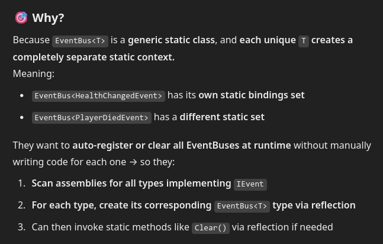

https://www.youtube.com/watch?v=4_DTAnigmaQ

The main point here is that we create static ~~classes~~ context for each event type using reflection: we search for all the types who implement `IEvent` interface and then, knowing those, we simply create `EventBus` static class to exist for each found event?
Seems

