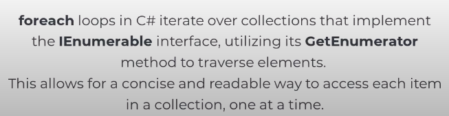

https://www.youtube.com/watch?v=Q2gQs6gIzCM

---

# GameObject Extensions

Unity marks object for deletion when we use `Destroy`

Null coalescing assignment (??=) during that frame still knows it's not null by C# standards so it doesn't assign a new component
```csharp
gameObject.AddComponent<AnimationManager>();
animationManager = animationManager ??= GetComponent<AnimationManager();
Debug.Log(animationManager == null); // true
```

---

https://www.youtube.com/watch?v=Nk49EUf7yyU&

## Using GetOrAdd

Null by Unity standards == marked for deletion (non yet actually deleted)

So use that approach

# Transform Extensions


But it creates a new object any time we use it
So basic `forloop` if often preferable