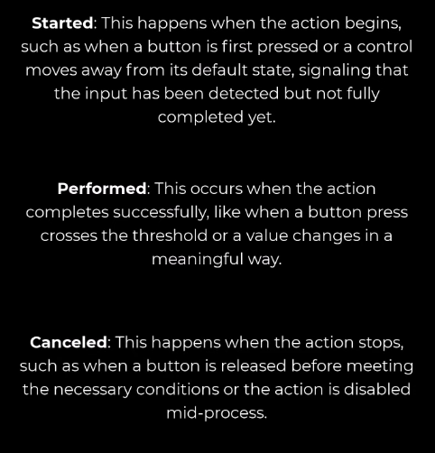

https://www.youtube.com/watch?v=z5zShkCR0mg&t=5s

---

The highest level of abstraction

The generated C# class is an alternative to the player input component

performed is fired only when action actually completed (it can have some interactions modifiers)
.WasPressedThisFrame don't take that into an account
