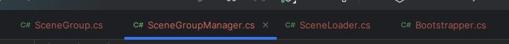
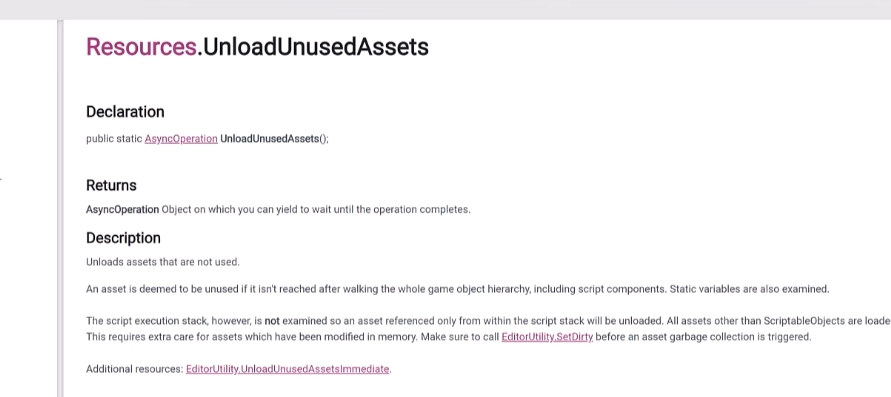

https://www.youtube.com/watch?v=JFP-cCFID7o

Bootstrapping scene?
Active Scene?

Three scripts:

And one more - Bootstrapper

Active scene is ignored when loading. And it's where objects get instantiated

And for implementing communication between scenes it's a good Idea to use `EventBus` and `InversionOfControl` (Service Locator)

There is also an option to unload unused assets

