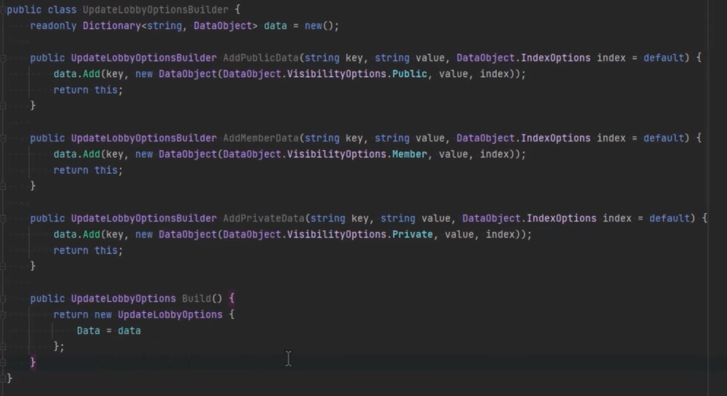
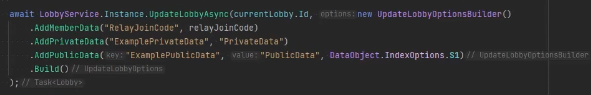
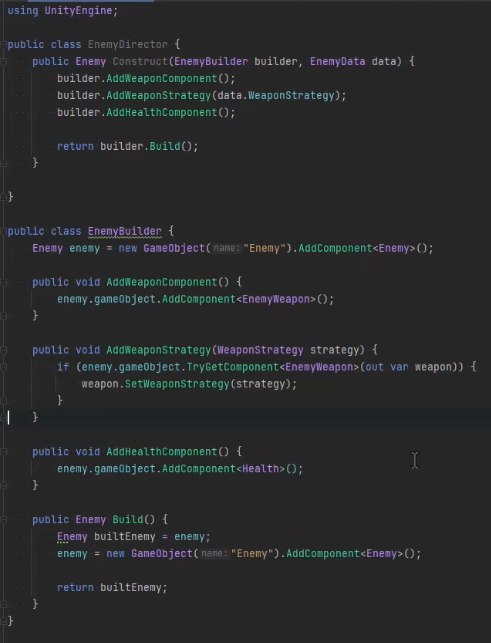
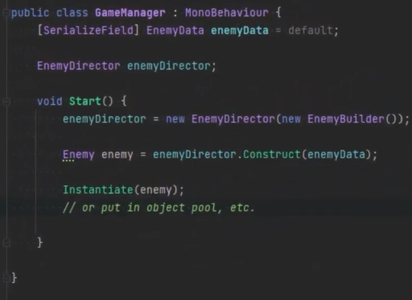
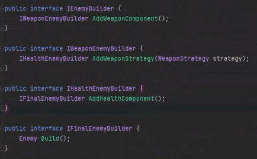
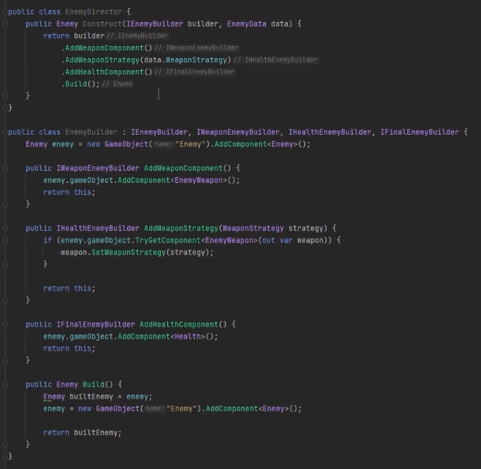

git-amend: https://youtu.be/Wud_ooJKdzU?si=nN2HCE4C6Unr8Fqe

Builder is good to be used when I have multiple variants of one objects. Eg. thousands of goblins - it's better to alter them with builder; VFX, SFX

Fluent Builder example 2:

# With Director

Use it to enforce a fixed sequence

Usage:

But it's better to store EnemyBuilder instance inside the Director

# With interfaces

Enforces order too
But it's crazy 

