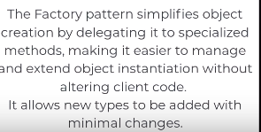
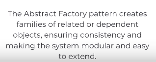

Git-Amend: https://youtu.be/Z1CDJASi4SQ?si=J7rdynlhFoD1yzOU

# Static Creation Method

= Static Factory Method

Code smells:
- Logic in constructor

# Factory Pattern

The idea is **DECOUPLE WEAPONS FROM UNITS** = **CLIENT FROM OBJECT CREATION**

Units defend on factories supplying the items, but they don't care how those items they made

Supply network configs, access to repository for saving data

It delegates object creation to specialized methods, making client code easier to manage and extend. New types can be added with minimal changes

Code smells:
- Switch creating objects
- Violating the S: client code is responsible for creating objects

Factory' responsibility is to provide a product to consumer

I can cache objects whether in client or in factory itself (check bow example). And it maybe use `provide` as a name instead of `create` 

# Abstract Factory

Create a family of related objects
So to group several factories together

And now I just create a new weapon, create a factory for it, and assign it to my equipment factory

# Sources

Definition

Bad client code example

Abstract factory
