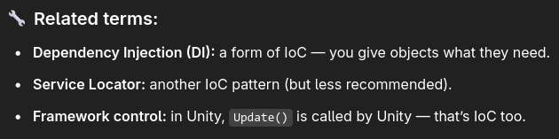
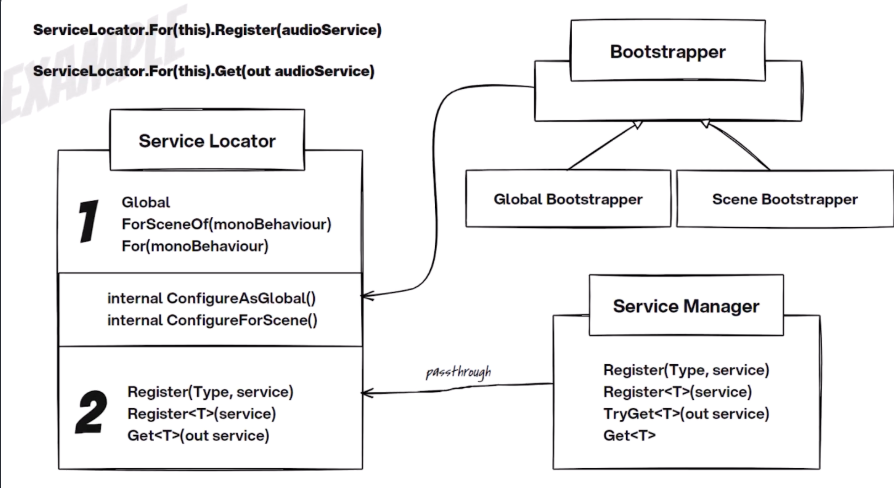

https://youtu.be/D4r5EyYQvwY?si=ol75nx9470M062v_

IoC - Your classes don’t create their own dependencies. They get them from the outside.

Soooo it's just to register some global and scene services like localization etc? Something that's singular for that scale

And I can register services that's on some `GameObject`? And it will go to the same scale

IoS can be done with both Dependency Injection and Service Locator

Inverting dependencies
Problem:
1. Tightly coupled to a specific implementation of a type
2. Can't exposed made instance without making it public

It acts as a central repository for all the references of things we are going to need access to - SO THIS IS WHY IT'S GOOD FOR MEDIATOR AND UI?????
So we don't have to start linking all our game objects together
It allows us to get references with registering services:
- On GameObject lvl
- On Scene lvl
- On Global lvl

Register in Awake, use at Start and later 

ServiceManager - storage and retrieval of different services
Bootstraper does configuration when we want a locator of a different type