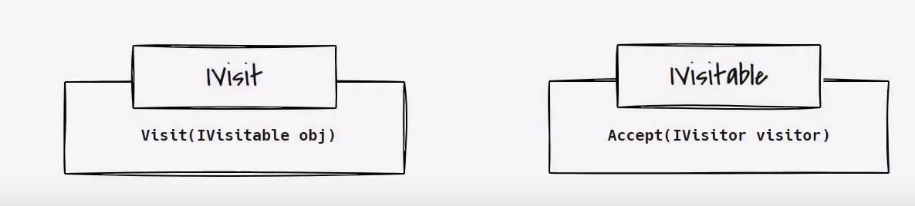

https://youtu.be/Q2gQs6gIzCM?si=HfIZLZ0ZCTUfllsm

Power up system

Based on Double Dispatch

Types:
- Classic
- Intrusive - logic is in the class that's being visited. So we just add methods there that we call
- Reflective

So we:
1. Call the `Accept` method of IVisitable with the actual visitor as a parameter
2. It calls the `Visit` method of the visitor
3. Logic is run in the `visit` method

The flow is just:
1. Visitable (with ref of visitor)
2. Visitor (does logic in visitable)