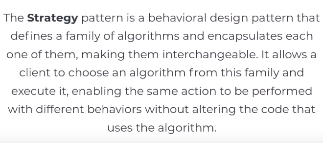
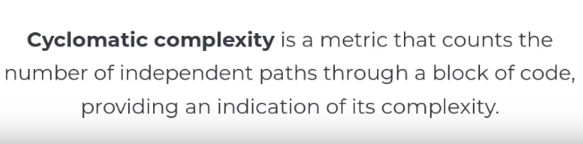
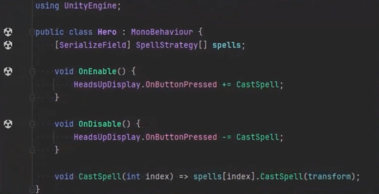
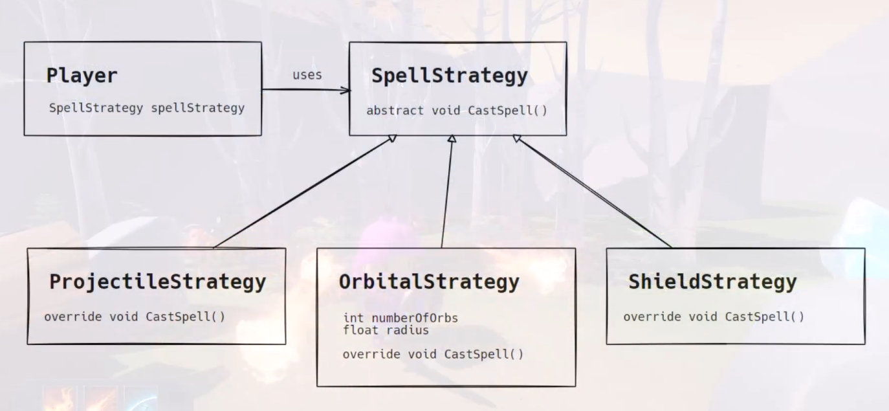
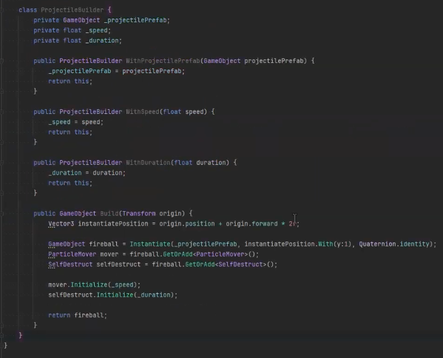

git-amend vid: https://youtu.be/QrxiD2dfdG4?si=SRxPs1EmoqVGpJnk

Our hero knows NOTHING about actual spells. They just.. USE THEM YES. Just totally relies on abstraction

cyclomatic complexity:

The power of the Strategy pattern (easy to read decoupled code):

Sooo and this is here IS a Builder. I REALLY need to grasp the stuff

So then Just:

