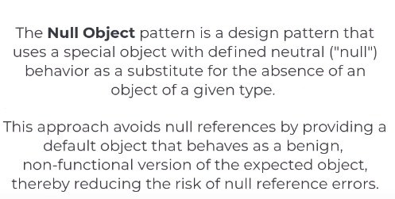
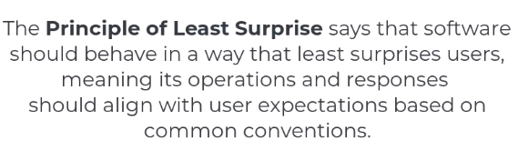

https://www.youtube.com/watch?v=LFOXge7Ak3E

# Null Object Pattern

So, just use some non-functional stuff instead of a null

# Default interface methods??

IT'S A FEATURE FROM C# 8?

Wow, I can have logic in my interfaces??
A good use case - to have a factory method for creating new instances

BUT:
